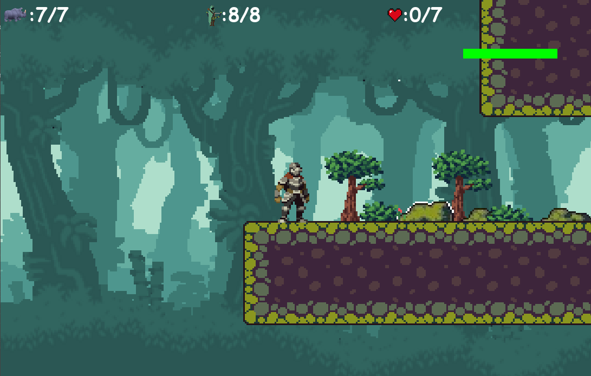
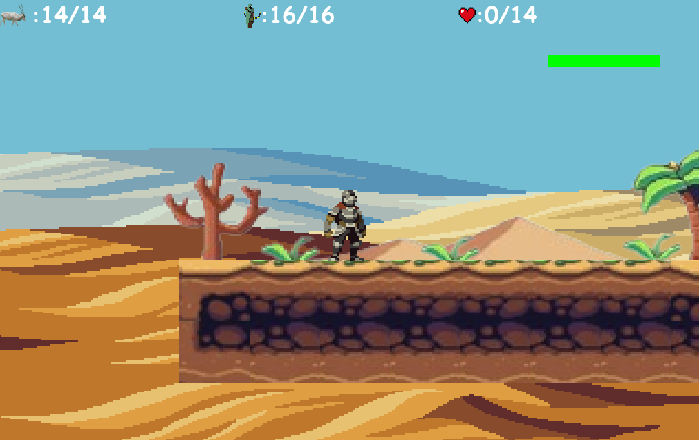
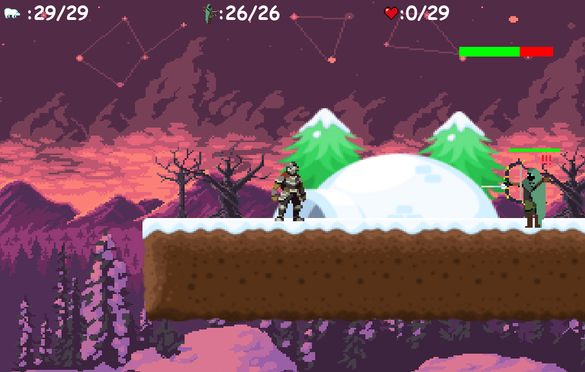

# Guardain Trails

## Save Wildlife: Say No to Poaching!

- Poaching is a devastating threat to wildlife worldwide, fueled by illegal trade and
    driven by demand for animal parts.
- Wildlife plays a crucial role in maintaining ecosystem balance, including carbon
    sequestration and climate regulation. Poaching-induced declines in wildlife
    populations can indirectly contribute to climate change impacts.
- Poaching can have severe economic repercussions, especially in regions heavily
    reliant on wildlife tourism. The loss of iconic species can lead to reduced tourist
    interest, affecting local economies and livelihoods.
- Highlighting successful conservation efforts and initiatives that have led to the
    recovery of threatened species can inspire hope and demonstrate that positive
    change is possible.

# Gamification

## What is the game?

To highlight the need to save animals, we have developed a platformer game
consisting of three characters-the hero, poachers, and animals exotic to the
specific environment portrayed and heavily endangered.

The backbone of the game is to kill the poachers who are hunting down the
animals and heal them back to good health. The main motive is to save as
many animals as possible, though the game ends when the poachers have
already killed more than a specific limit of animals. The level of the game
progresses as soon as all the poachers on the map are killed. Changing the
level implies changing the map, and it is difficulty.

The various levels in the game are rainforest, desert, and snowy regions,
highlighting one animal species each that is heavily endangered. The
Rainforest map highlights saving Rhinos, the desert highlights saving
Addaxes, and the snowy region highlights saving polar bears. Many maps
can be created and integrated into the game to pay attention to many more
species.

## Animals in Highlight

1. <strong><em>Rhino</em></strong> –Rhinos are generally found in the grasslands and swampy areas like Assam in
    India. They have been hunted down greatly due to their precious horn.
2. <strong><em>Addax</em></strong> -The addax, also known as the white antelope or screwhorn antelope, is a
    species of antelope native to the Sahara Desert and parts of North Africa. Threats such
    as habitat loss, hunting for meat and trophies, and competition with domestic livestock
    have contributed to their decline.
3. <strong><em>Polar Bear</em></strong> - Polar bears are found throughout the Arctic Circle, primarily on the sea
    ice of the Arctic Ocean. They are highly adapted to their icy environment and rely on
    sea ice for hunting seals, their primary food source. They have been hunted down due
    to their fur and meat.

## Technical Aspects

The libraries used for building the game are:

- <strong><em>PyGame</em></strong> –It provides functionalities for handling graphics, sound, input devices like
    keyboards and mice, and more. Pygame is built on top of the Simple DirectMedia Layer
    (SDL), which is a low-level multimedia library that Pygame wraps to make game development
    easier in Python.
- <strong><em>Pyvidplayer2</em></strong> –It is a python library used to play videos. It works similar to pyvidplayer.
To build the game, object-oriented methods were deployed. Physics of various objects were defined
separately and how they interact with each other is also defined, for ex: collision, falling down due to
gravity, not getting hurt due to shield, attacking an enemy, walking, jumping, sliding, etc.
The objects are portrayed via pixel art and the interactions via sound effects which are freely
available online. To design the maps, level editors were also coded up to create jsonformat maps
based on our representation of data. Each level editor may also function as a separate game which
could be used to display creativity and make maps, more like a heavily scaled down version of
Minecraft!

## Gameplay:

This is the first level
involving saving Rhinos
and designed in a forest
environment.
The three icons on the top
denote Animals alive,
Enemies alive and Animals
healed, from left to right.

## Gameplay:

This is the second level
involving saving Addaxes
from the enemies.
We can see that the level
gets harder as the number
of animals to be saved and
the number of enemies both
increased.

## Gameplay:

This is the third level
involving saving Polar Bears
from the enemies in an
Arctic environment.
We can see that the level
gets even harder as the
number of animals to be
saved and the number of
enemies both increased
even more.

